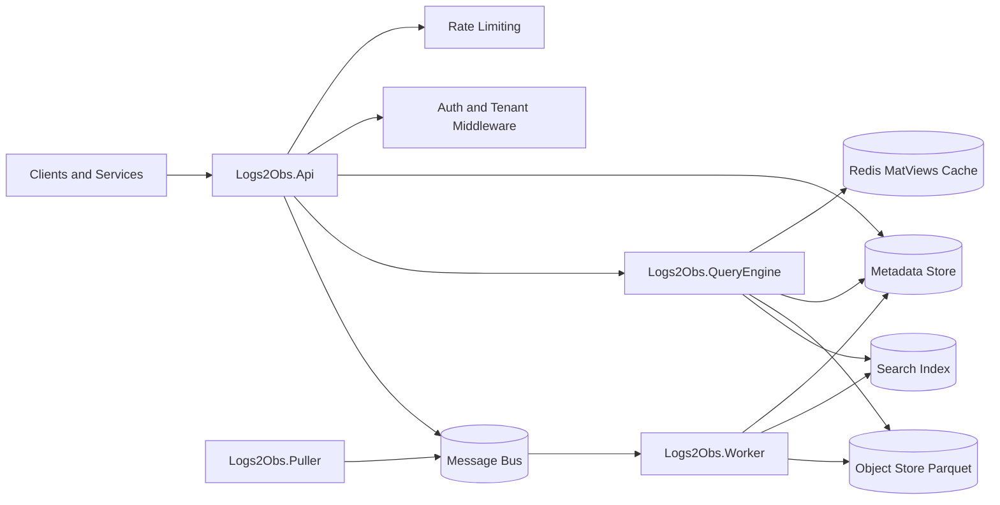
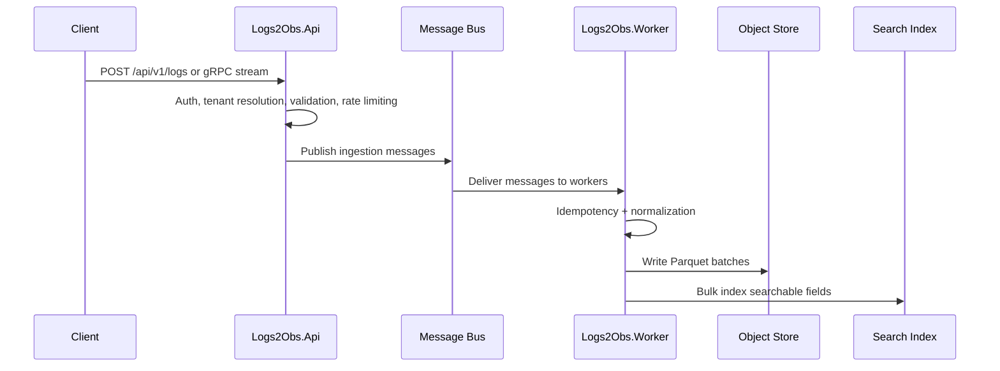
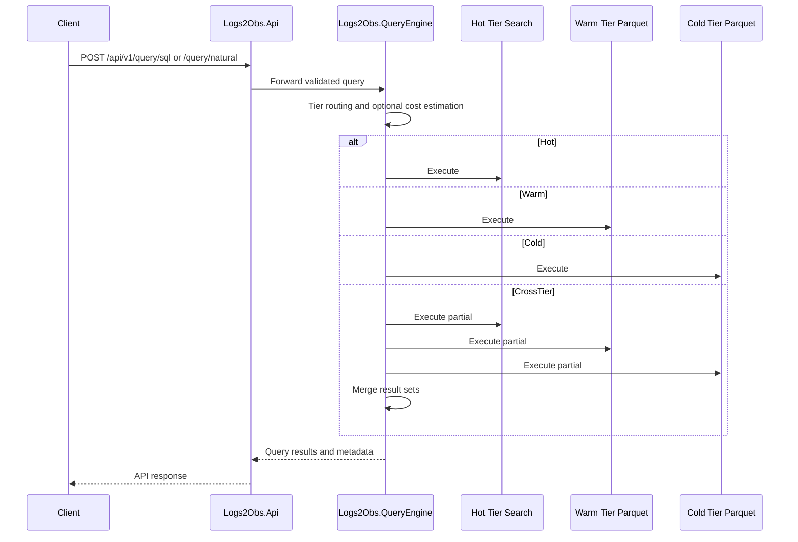

# Architecture

This document explains how logs2obs is structured, how data moves through the system, and where key responsibilities live.

## Architectural Style

logs2obs follows a hexagonal architecture:

- `Logs2Obs.Core` defines domain models, commands, query abstractions, validation, mapping, and orchestration logic.
- Adapter projects (`Logs2Obs.Adapters.Local`, `Logs2Obs.Adapters.Aws`) implement infrastructure interfaces from Core.
- Host projects (`Logs2Obs.Api`, `Logs2Obs.Worker`, `Logs2Obs.QueryEngine`, `Logs2Obs.Puller`) wire dependencies, expose protocols, and run background workflows.

This separation keeps domain logic provider-agnostic while allowing runtime selection via `Logs2Obs__Provider`.

## Component Overview

## Service Responsibilities

### `Logs2Obs.Api`

- Exposes REST and gRPC ingest/query APIs.
- Authenticates callers using API key or JWT.
- Applies tenant-aware rate limiting.
- Publishes ingestion workloads to queue-based processing.
- Proxies/coordinates query and analytics features.

See:

- [api-reference.md](api-reference.md)
- [security.md](security.md)
- [../src/Logs2Obs.Api/README.md](../src/Logs2Obs.Api/README.md)

### `Logs2Obs.Worker`

- Consumes queue messages from ingestion fanout.
- Performs idempotency checks.
- Writes normalized data to Parquet/object storage.
- Updates search index for low-latency retrieval.

See:

- [../src/Logs2Obs.Worker/README.md](../src/Logs2Obs.Worker/README.md)
- [replay-guide.md](replay-guide.md)

### `Logs2Obs.QueryEngine`

- Routes queries to hot/warm/cold execution paths.
- Handles query cost estimation and execution policies.
- Supports graph generation and materialized-view access.
- Coordinates replay, alert, and analytics workloads.

See:

- [query-guide.md](query-guide.md)
- [graph-guide.md](graph-guide.md)
- [materialized-views.md](materialized-views.md)
- [../src/Logs2Obs.QueryEngine/README.md](../src/Logs2Obs.QueryEngine/README.md)

### `Logs2Obs.Puller`

- Pulls logs from scheduled sources (cloud/object/http connectors).
- Normalizes pulled payloads into ingest pipeline messages.
- Publishes to downstream worker queues.

See:

- [../src/Logs2Obs.Puller/README.md](../src/Logs2Obs.Puller/README.md)
- [replay-guide.md](replay-guide.md)

### `Logs2Obs.Adapters.Local` and `Logs2Obs.Adapters.Aws`

- Provide concrete implementations for object store, metadata store, message bus, scheduler, query providers, secrets, and search.
- Enable the same Core logic to run against Local dev stack or AWS services.

See:

- [../src/Logs2Obs.Adapters.Local/README.md](../src/Logs2Obs.Adapters.Local/README.md)
- [codebase-map.md](codebase-map.md)

## Ingestion Data Flow

## Query Flow

## Cross-Cutting Concerns

- Authentication and tenant isolation: [security.md](security.md)
- API contracts and endpoint behavior: [api-reference.md](api-reference.md)
- Tier routing and query efficiency: [query-guide.md](query-guide.md)
- Schema lifecycle: [schema-evolution.md](schema-evolution.md)
- Replay and recovery workflows: [replay-guide.md](replay-guide.md)
- Operational readiness and incident response: [runbooks/incident-response.md](runbooks/incident-response.md)

## Related Documents

- [README.md](README.md)
- [codebase-map.md](codebase-map.md)
- [local-development.md](local-development.md)
